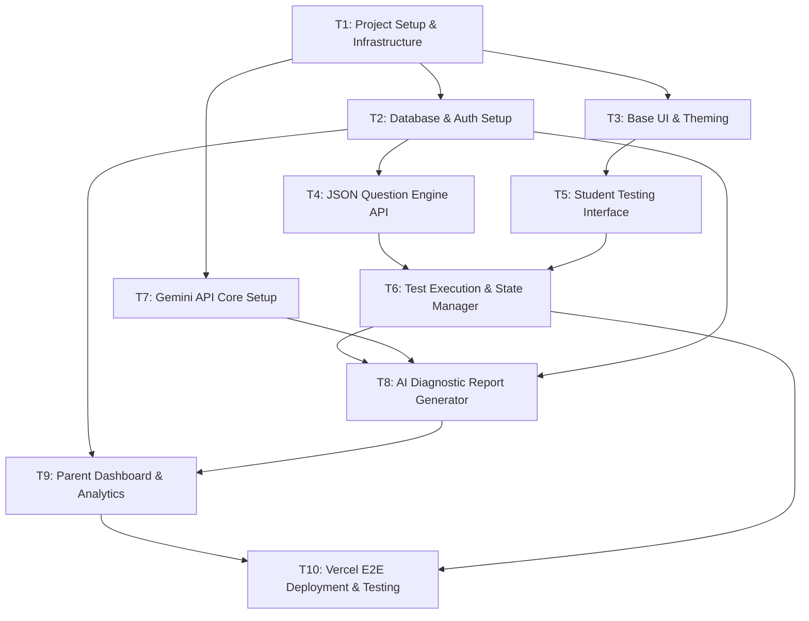

Here is a comprehensive implementation plan designed for autonomous coding agents. The plan is structured around a modern Next.js stack tailored for deployment on Vercel, integrating the Gemini API for the AI-powered diagnostic reports.

### 1. Technology Stack Selection

To ensure seamless deployment on Vercel and robust handling of JSON-based schemas and AI interactions, the following stack is selected:

* **Framework:** Next.js 15 (App Router) – Native to Vercel, utilizing Server Components and Server Actions for optimal performance.
* **Language:** TypeScript – Essential for strict typing of the flexible JSON question schemas and agentic handoffs.
* **Database & Auth:** Supabase (PostgreSQL) – Excellent for storing highly flexible `JSONB` question configurations and handling parent-centric Role-Based Access Control (RBAC).
* **AI Integration:** Vercel AI SDK (`npm install ai @ai-sdk/google`) combined with the Gemini API for generating structured diagnostic reports.
* **Styling:** Tailwind CSS + shadcn/ui – For rapidly building a clean, child-friendly testing UI and a data-rich parent dashboard.

---

### 2. Task Dependency Graph (DAG)

The following Directed Acyclic Graph (DAG) outlines the strict sequence in which coding agents must execute the tasks. A child task cannot begin until all its parent tasks are successfully completed and verified.

---

### 3. Detailed Task Implementation Plan

#### **T1: Project Setup & Infrastructure (Root Task)**

* **Dependencies:** None
* **Objective:** Scaffold the Next.js application, configure Tailwind, and set up the repository for Vercel deployment.
* **Agent Instructions:**
1. Initialize a Next.js App Router project using TypeScript.
2. Install core dependencies: `ai`, `@ai-sdk/google`, `zod`, `lucide-react`, and Supabase client ` @supabase/supabase-js`.
3. Configure `.env.local` template with placeholders for `NEXT_PUBLIC_SUPABASE_URL`, `NEXT_PUBLIC_SUPABASE_ANON_KEY`, and `GOOGLE_GEMINI_API_KEY`.
4. Set up standard code formatting (Prettier/ESLint) to ensure consistency across future agent tasks.

* **Acceptance Criteria:** The Next.js app compiles successfully. The environment variables are strongly typed using a tool like `t3-env` or a central config file.

#### **T2: Database Schema & Authentication Setup**

* **Dependencies:** T1
* **Objective:** Provision the Supabase PostgreSQL database and configure the Parent/Student data models.
* **Agent Instructions:**
1. Initialize Supabase project and set up email/password authentication for Parents.
2. Create the following SQL schema:
* `parents` (id, email, created_at)
* `students` (id, parent_id, name, age, created_at)
* `test_sessions` (id, student_id, concept, start_time, end_time, status)
* `test_answers` (id, session_id, question_id, raw_answer, time_taken, is_correct)
* `diagnostic_reports` (id, session_id, ai_generated_report JSONB, created_at)

3. Implement Row Level Security (RLS) ensuring parents can only access their own children's data.
4. Create Next.js server actions to handle login, signup, and session management.

* **Acceptance Criteria:** A parent can register, log in, add a child profile, and RLS policies successfully block cross-account data access.

#### **T3: Base UI Component Library & Theming**

* **Dependencies:** T1
* **Objective:** Establish the visual language for both the low-stakes student interface and the analytical parent dashboard.
* **Agent Instructions:**
1. Initialize `shadcn/ui` components (Buttons, Cards, Forms, Progress bars, Modals).
2. Define two main layout wrappers: `ParentLayout` (sidebar, analytical colors) and `StudentLayout` (full screen, distraction-free, playful colors, large fonts).

* **Acceptance Criteria:** The component library is accessible (a11y compliant) and the two distinct layout shells render correctly.

#### **T4: Flexible JSON Question Engine & Repository API**

* **Dependencies:** T2
* **Objective:** Create the system that stores, parses, and serves the mathematical questions based on target concepts.
* **Agent Instructions:**
1. Define a strict TypeScript interface `QuestionSchema` using `Zod`. It must include fields for: `id`, `concept` (e.g., "Division"), `complexityLevel` (1-3), `languageDemand` (symbolic, structured_word, narrative), `questionType` (MCQ, TEXT), `content`, and `expectedAnswer`.
2. Create a local JSON repository (e.g., `content/math-questions.json`) populated with sample data following the proposal's multi-layered language demand model.
3. Build a Next.js API Route (`/api/questions/generate`) that accepts a `concept` and `targetAge`, returning an array of Question IDs to form a test.

* **Acceptance Criteria:** The API successfully returns a valid, typed JSON array of questions matching the requested concept and complexity.

#### **T5: Student Testing Interface (UI)**

* **Dependencies:** T3
* **Objective:** Build the decoupled front-end components that render different question types.
* **Agent Instructions:**
1. Create a `QuestionRenderer` component that dynamically imports the correct UI based on the JSON `questionType` (e.g., `MultipleChoiceComponent`, `TextAnswerComponent`).
2. Ensure the design accommodates future expansions (e.g., passing a generic prop interface so a future `DiagramComponent` can just plug in).
3. Build large, touch-friendly inputs suitable for ages 6-9.

* **Acceptance Criteria:** The UI accurately renders a mock JSON question object and captures user input without page reloads.

#### **T6: Test Execution & State Management (Future-Proofed for Adaptive)**

* **Dependencies:** T4, T5
* **Objective:** Manage the flow of the test, tracking answers, time spent, and facilitating the dynamic next-question logic.
* **Agent Instructions:**
1. Create a React Context or use Zustand to manage `TestSessionState`.
2. Implement the logic to display one question at a time.
3. **Crucial:** Build the state transition logic dynamically. Instead of pre-loading all questions into an array, fetch the *next* question based on the previous answer's result. (Currently, it can fetch from a predefined list of IDs, but the architecture must query the API for "next question" after every submission).
4. Upon test completion, submit the `test_answers` array to the Supabase database.

* **Acceptance Criteria:** A student can start a test, answer questions sequentially, and the final payload of answers (including time-taken per question) is saved to the DB.

#### **T7: Gemini API Core Setup**

* **Dependencies:** T1
* **Objective:** Establish a secure server-side pipeline to communicate with Google's Gemini models using the Vercel AI SDK.
* **Agent Instructions:**
1. In a secure server action or API route (`/api/ai/diagnostic`), initialize the `@ai-sdk/google` provider.
2. Configure the system prompt. The prompt must instruct Gemini to act as an expert primary mathematics diagnostician. It must be explicitly told to differentiate between *mathematical misconceptions*, *language comprehension barriers*, and *cognitive load* based on the student's performance across different `languageDemand` tiers in the JSON schema.

* **Acceptance Criteria:** A test script successfully pings the Gemini API with a mock student payload and receives a text response.

#### **T8: AI Diagnostic Report Generator**

* **Dependencies:** T6, T7, T2
* **Objective:** Feed test results to Gemini and generate the structured actionable report, saving it to the database.
* **Agent Instructions:**
1. Retrieve the completed `test_session` and associated `test_answers` from Supabase.
2. Join the answers with the original `QuestionSchema` metadata to construct a rich context payload.
3. Use the Vercel AI SDK `generateObject` method to force Gemini to return a structured JSON response matching a `Zod` schema:
* `overallScore`: string
* `rootCauseAnalysis`: string (explaining the math vs language gap)
* `strengths`: string[]
* `weaknesses`: string[]
* `actionableNextSteps`: string[]

4. Save this generated JSON object into the `diagnostic_reports` table linked to the `session_id`.

* **Acceptance Criteria:** Completing a test automatically triggers the AI call, which successfully structures the output and saves the rich diagnostic report to the database.

#### **T9: Parent Dashboard & Analytics UI**

* **Dependencies:** T2, T8
* **Objective:** Provide parents with independent, evidence-informed insights into their child's progress.
* **Agent Instructions:**
1. Build the `/dashboard` route accessible only to authenticated Parents.
2. Create a list view of the child's past tests.
3. Build a detailed `ReportView` component that renders the AI-generated JSON report beautifully (using charts for scores, clear lists for strengths/weaknesses, and highlighted boxes for actionable next steps).
4. Implement longitudinal tracking: A simple line chart (using `recharts`) showing performance over time if multiple tests exist for a concept.

* **Acceptance Criteria:** Parents can log in, view their child's completed tests, and read the AI-generated diagnostic report with visual data representation.

#### **T10: End-to-End Integration & Vercel Deployment**

* **Dependencies:** T9, T6
* **Objective:** Finalize the application, ensure all environments are secure, and deploy to Vercel.
* **Agent Instructions:**
1. Write a suite of basic E2E tests (using Playwright or Cypress) to simulate a user logging in, a child taking a test, and the parent viewing the report.
2. Ensure all `console.logs` are removed and error handling gracefully degrades (e.g., if Gemini API times out, show a "Generating Report..." retry state).
3. Configure `vercel.json` if custom routing is needed.
4. Push to the main branch to trigger a Vercel production build, ensuring `GOOGLE_GEMINI_API_KEY` and Supabase keys are mapped in the Vercel Project Settings.

* **Acceptance Criteria:** The application is live on a Vercel URL. All functions, including database writes and AI report generation, operate flawlessly in the production environment.
